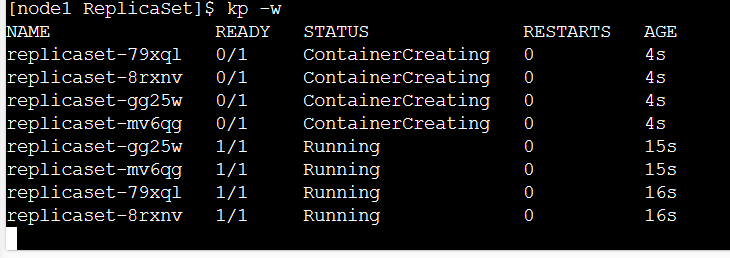

### Pods 
* Scaling: Scaling in k8s means increasing number of Pods not containers in Pod. For Scaling pods we would learn Replica set/Replication Controller etcs..

* To write manifest files [Refer Here](https://kubernetes.io/docs/reference/generated/kubernetes-api/v1.28/)
* How k8s identifies objects: Labels
* Label is a key pair examples are
    * app: nginx
    * version: v1.0
* Labels are used to select/query kubernetes objects
* [Refer Here](https://kubernetes.io/docs/concepts/overview/working-with-objects/labels/) for official docs on labels
* Selectors in k8s help in querying objects using labels
* [Refer Here](https://github.com/jagadeesh9666/k8s/commit/5e9973ee223754f52857f4aff58e6240a690477b#diff-d1590d82e06f13a05dc9b42f83585ac90aea08e24debd9ea81f2bb7d3481d877) for the code with labels


* selectors are of two types
    * Equality Based Selectors (Equality- or inequality-based requirements allow filtering by label keys and values.)
       - Equility based  `kubectl get pods -l <key>=<value>`
       - Inequility based `kubectl get pods -l <key>!=<value>`

       
       
     
       
    
* Set based selectors`kubectl get pods -l '<key> in (<value>'`


### Interacting with containers
* In docker docker container exec -it or docker container exec
* in k8s we have kubectl exec


* Interactive ` kubectl exec <pod name> -it -c <container name> -- /bin/sh `


 ### What happens when container goes into exited state
* Lets create a pod with ubuntu container which exits
[Refer Here](https://github.com/jagadeesh9666/k8s/commit/305fcdb1e94f142ef22afc72830dd5efd426e7ae) for the changes
* kubernetes tries to restart containers, if it fails continuous k8s keeps trying and gives the status as CrashLoopBackoff


* Kuberentes restarts the containers always as the restartPolicy Default value is Always, which we can change [Refer Here](https://kubernetes.io/docs/concepts/workloads/pods/pod-lifecycle/#restart-policy)

 ### Container types in Pod
* init containers: These containers are created prior to actual/main containers. ideally these containers should be short lived and majorly for meeting preconditions to run your application. [Refer Here](https://kubernetes.io/docs/concepts/workloads/pods/init-containers/) for official docs
* containers: This is where we run actual applications and they are expected to be living forever (continously)
[Refer Here](https://github.com/jagadeesh9666/k8s/commit/3d7fdb7723dbcb518f983b7954afa7a728838462) for changes


### Pod lifecycle
[Refer Here](https://kubernetes.io/docs/concepts/workloads/pods/pod-lifecycle/) for documents


 ### Resource Restrictions in Pods
[Refer Here](https://kubernetes.io/docs/concepts/configuration/manage-resources-containers/) for official docs
* Limits in Resoruce Restrictions mean maximum size that will be allocated (upper bounds/limits) and request are lower limits
[Refer Here](https://github.com/jagadeesh9666/k8s/commit/1dafa628703f5a79788c29b11a7d0c46d2d374ad) for the changes

### Controllers
* Pod tries to keep containers running, but for us we need to keep Pods running according to some state, Lets understand first two categories
    * Replicas:
       - Here we have two resources ReplicationController, ReplicaSet
       - Here our desired state (spec) will be
          - number of replicas
          - pod spec
          - label selector
       - These objects try maintain the desired
    * Jobs:
       - These will run the Pods which have finite execution time period
       - Here we have two resources
           - Job
           - CronJob
### ReplicaSet
* This Resource is responsible for maintaing the desired state of number of replicase of pod .
* [Refer Here](https://kubernetes.io/docs/concepts/workloads/controllers/replicaset/) for dockments

### Activity:
* Create a replica set with 3 replicas of jenkins/jenkins
* The label in selector should match with label in template , if not the pods will not get created.

* [Refer Here](https://github.com/jagadeesh9666/k8s/commit/00dcb36db964fdf161efc1596452f8a274ff582c?diff=split) for manifest file


* matchlabels is a equility based
* Now delete one pod and observe , ther will be new pod created to maintain desired number of replicas
 
* Lets try set based selectors [Refer Here](https://github.com/jagadeesh9666/k8s/commit/cdbe8eb187385d7a934d2fc21fb634054abe43b8) for the changes
* Exercise: Write a Replication controller for creating 3 spc pods
[Refer Here](https://github.com/jagadeesh9666/k8s/commit/40f891f718a15b9c6fb8185464a350d187d7705f) for code changes.

### Jobs and Cron Jobs

* [Refer Here](https://kubernetes.io/docs/concepts/workloads/controllers/job/) for Offical jobs documentation and [Refer Here](https://kubernetes.io/docs/concepts/workloads/controllers/cron-jobs/) for Official CronJob Documentation
* job will not get completed until the created pod is deleted 
* lets create a job which creates a container for 10 seconds
* [Refer Here](https://github.com/jagadeesh9666/k8s/commit/09b797d529dcae88db78dfeac8ae30fb9518c45f) for the changes
 

* Lets write a Cron Job which runs spc pod with command 1d for every mins
* cornjob creates a new pod for specified time contineously.
* [Refer Here](https://github.com/jagadeesh9666/k8s/commit/d80712975b5817d4cc643b2ac14f209cf33951d2) for the changes
 

### Namespace
* Namespace in k8s is a logical space or logical cluster in which resources will be created
* Any resource which has a value of Namespace = true belongs in a namespace and with Namespace=false is shared across namespaces.
* [Refer Here](https://kubernetes.io/docs/concepts/overview/working-with-objects/namespaces/) for official docs

### Service in K8s
* Every Pod when created gives a unique ip address and Name
* When Pods are scaled
* Lets create a replicaset with 3 nginx pods with label app:nginx
```
---
apiVersion: apps/v1
kind: ReplicaSet
metadata:
  name: nginx-rs
  labels:
    app: nginx
    purpose: svcdemo
spec:
  replicas: 3
  minReadySeconds: 1
  selector:
    matchLabels:
      app: nginx
  template:
    metadata:
      labels:
        app: nginx
    spec:
      containers:
        - name: nginxc
          image: nginx:1.25
          ports:
            - containerPort: 80
              protocol: TCP
```
* We need to access nginx with in cluster, but pod ips are not reliable, so as shown in the below image, lets create a k8s service resource which gives a consistent ip and name to access all the pods matching labels (equality based selection)

* service in k8s is of 4 types
  * Cluster IP
  * None
  * External
  * LoadBalancer
* Lets create nginx rs and and service and view endpoints. As discussed in the class when pods get update the endpoints are reflected. Service will forward the requests to endpoints
* [Refer Here](https://github.com/jagadeesh9666/k8s/commit/6e96dfedbd8f8963237a24b503a64e15a71ebd62) for the code

### Managed Kubernetes or Kubernetes as a Service
* Managed Kuberenetes (Kubernetes as a Service) is the offerings from various cloud providers.
* In these Control-Plane is managed by Cloud Service Providers and they charge you hourly for that
* For worker nodes, storage and other resources charges are as usual.
* Popular Kuberentes offerings
* AKS (Azure Kubernetes Services)
* EKS (Elastic Kuberentes Services)
* GKE (Google Kubernetes Engine)

* K8s as a service basically means the master nodes will be managed by cloud provider

### Elastic Kubernetes Service
* This is managed service from AWS
* EKS is easily created from a tool called as eksctl
* Install aws cli and configure authentication for aws iam user
* [Refer Here](https://eksctl.io/) for yaml file for eks cluster
* Lets create a config file `eks-cluster.yaml`
```
apiVersion: eksctl.io/v1alpha5
kind: ClusterConfig

metadata:
  name: jaeks-cluster
  region: ap-south-1

nodeGroups:
  - name: ng-1
    instanceType: t2.medium
    desiredCapacity: 2
```
* Now create the cluster by executing `eksctl create cluster -f eks-cluster.yaml`


### Exposing Applications running in cluster to externally as well as internally when scaled
* Every pod gets a unique ip and name.
*Connecting from one pod to other on the basis of name/ip might not be a good idea as pods are controlled by replicasets or other controllers
* K8s has a service which helps us in connecting to pods with similar behaviour but by using labels.
* Each service gets a ip address and this is virtual ip which helps in forwarding traffic to one of the pod based on labels. This ip is called as cluster ip
* Services can be exposed to external world

* Service is similar to layer 4 load balancer

### Internal Communication using k8s service (cluster ip )
* Consider the following
      * We have an alpine pod which needs to consume nginx
      * but nginx is a replica set and there can be n replicas
* Lets create a spc-rs
* Lets create a spc-svc
* Lets create a alpine pod and login into it
[Refer Here](./Images/k21.png)
* ping nginx-svc by its ip address and try accessing the web page using curl

[Refer Here](https://github.com/jagadeesh9666/k8s/commit/1b4ab60a23206d8dcaa75f24f2e9a67e13c78aeb) for internal communication manifests
