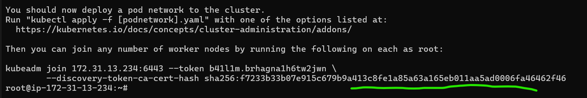
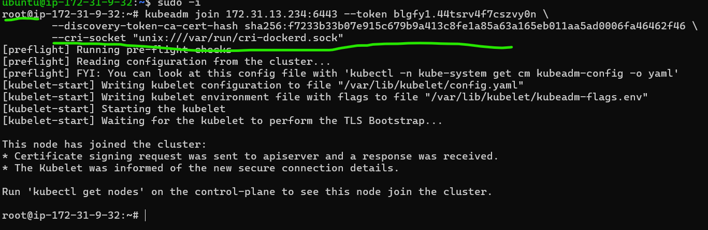

### Note : Below command's should be executed on all nodes

* To install kuberneties we required kubeadm, kubectl, kubelet to be present in all master and worker nodes.
* Run the below script to install docker on ubuntu user
* Docker should be installed on master and worker nodes. (below mentioned all steps should be done on all machines until specified to do something on master node)

```
curl -fsSL https://get.docker.com -o install-docker.sh
sh install-docker.sh
sudo usermod -aG docker ubuntu
```
* To install CRI-dockerd [Refer Here](https://github.com/Mirantis/cri-dockerd/releases) and get the latest releases. Below steps are specific to ubuntu 22.04

```
wget https://github.com/Mirantis/cri-dockerd/releases/download/v0.3.4/cri-dockerd_0.3.4.3-0.ubuntu-jammy_amd64.deb
sudo dpkg -i cri-dockerd_0.3.4.3-0.ubuntu-jammy_amd64.deb 

```
* [Refer Here](https://kubernetes.io/docs/tasks/tools/install-kubectl-linux/) to install kubelet , kubeadm and kubectl

```
sudo apt-get update
sudo apt-get install -y apt-transport-https ca-certificates curl
curl -fsSL https://pkgs.k8s.io/core:/stable:/v1.28/deb/Release.key | sudo gpg --dearmor -o /etc/apt/keyrings/kubernetes-apt-keyring.gpg
echo 'deb [signed-by=/etc/apt/keyrings/kubernetes-apt-keyring.gpg] https://pkgs.k8s.io/core:/stable:/v1.28/deb/ /' | sudo tee /etc/apt/sources.list.d/kubernetes.list
sudo apt-get update
sudo apt-get install -y kubelet kubeadm kubectl
sudo apt-mark hold kubelet kubeadm kubectl

```
### Note: Below command should be executed on one node to turn it as master node.

* Now Lets create a k8s cluster using kubeadm [Refer Here](https://kubernetes.io/docs/setup/production-environment/tools/kubeadm/create-cluster-kubeadm/)
* Execute the following on master node
* Lets initialize the cluster using the following command as a root user

* execute ' kubeadm init --help ' in machine
* to assign ip for our pod '--pod-network-cidr "10.244.0.0/16" '
* ' --cri-socket "unix:///var/run/cri-dockerd.sock" ' this step is not required for EKS and ASK , it should bo done only for manual installation. 

```
kubeadm init --pod-network-cidr "10.244.0.0/16" --cri-socket "unix:///var/run/cri-dockerd.sock"

```
* while you execute the above command , at last you will find a kubeadm join token , note it and add a cri-socket command at last and execute it on worker nodes 


* On the master node to run kubectl as regular user and execute the following
```
mkdir -p $HOME/.kube
sudo cp -i /etc/kubernetes/admin.conf $HOME/.kube/config
sudo chown $(id -u):$(id -g) $HOME/.kube/config

```
### Note: now on worker nodes
* Now as a root user in worker nodes execute the join command

```
kubeadm join 172.31.13.234:6443 --token blgfy1.44tsrv4f7cszvy0n \
        --discovery-token-ca-cert-hash sha256:f7233b33b07e915c679b9a413c8fe1a85a63a165eb011aa5ad0006fa46462f46 \
        --cri-socket "unix:///var/run/cri-dockerd.sock"
```

* Now kuberentes needs CNI Plugin so that pod-network is enabled. Till this is done the DNS doesnot work, services donot work so nodes are shown as NotReady.
* We can choose among wide range of CNI Plugins, For this lets use flannel. Execute the following on master node
```
kubectl apply -f https://github.com/flannel-io/flannel/releases/latest/download/kube-flannel.yml

```
* Now execute kubectl get nodes -w and wait for all the nodes to get to ready state
* Kubectl cheatsheet [Refer Here](https://kubernetes.io/docs/reference/kubectl/cheatsheet/)
```
echo "source <(kubectl completion bash)" >> ~/.bashrc
```
* Lets setup autocomplete for kubectl
* note: use tabs